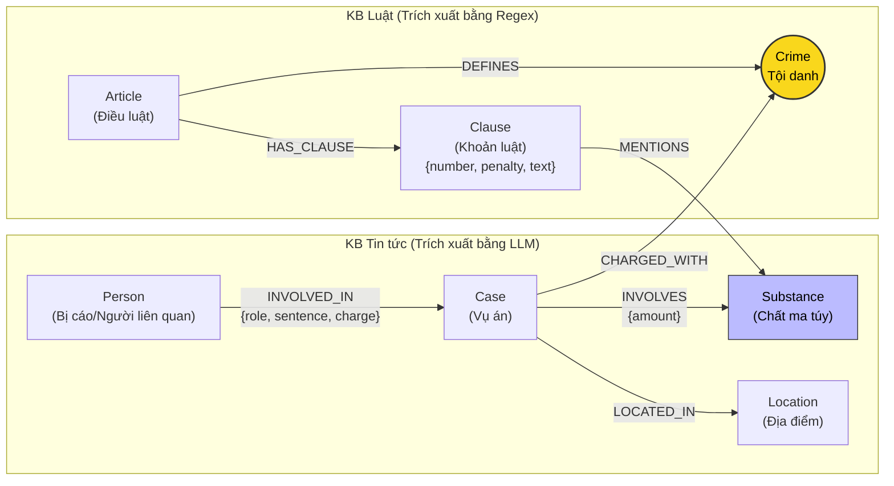

# Thiết kế Ontology — Day 19

**Họ tên:** Nguyễn Khắc Quang  **MSSV:** 2A202602885

**Lựa chọn** (đánh dấu một):
- [x] Dùng ontology gợi ý (tối ưu hóa quy trình trích xuất và chuẩn hóa multi-hop)
- [ ] Tự thiết kế (xét bonus +15, xem `SUBMISSION.md`)

---

## 1. Sơ đồ

Sơ đồ Knowledge Graph kết nối 2 cơ sở tri thức: **KB Tin tức** (các vụ án ma túy) và **KB Luật** (Bộ luật Hình sự 2015 & Luật Phòng, chống ma túy 2021). Node cầu nối trung tâm là **`Crime`** (Tội danh) và cầu nối phụ là **`Substance`** (Chất ma túy).

---

## 2. Entity types (node labels)

| Label | Ý nghĩa | Khóa định danh (`MERGE` theo) | Properties | Lấy từ KB nào | Trích bằng (regex / LLM / khác) |
| :--- | :--- | :--- | :--- | :--- | :--- |
| **`Article`** | Điều luật trong văn bản quy phạm pháp luật | `id` (ví dụ: `"Điều 251 BLHS"`) | `id`, `title`, `law`, `doc_id` | Luật (`data/drug_law/`) | Regex (tiêu đề file & front-matter) |
| **`Clause`** | Khoản cụ thể của Điều luật, chứa khung hình phạt và quy định chất | `id` (ví dụ: `"Điều 251 BLHS khoản 1"`) | `id`, `number`, `penalty`, `text`, `doc_id` | Luật (`data/drug_law/`) | Regex (đầu dòng số thứ tự `^\d+\.\s`) |
| **`Crime`** | Tội danh pháp lý chuẩn (Node cầu nối chính giữa luật và đời thực) | `name` (đã chuẩn hóa, ví dụ: `"mua bán trái phép chất ma túy"`) | `name` | Cả hai KB | Regex từ tiêu đề Điều (Luật) + LLM qua `link_entity` (Tin) |
| **`Substance`** | Tên chất ma túy hoặc tiền chất (Node cầu nối phụ) | `name` (tên chuẩn hóa, ví dụ: `"Heroine"`, `"MDMA"`) | `name` | Cả hai KB | List chuẩn + substring (Luật) + LLM qua list chuẩn (Tin) |
| **`Case`** | Vụ việc / vụ án cụ thể được phản ánh trên báo chí | `name` (tên vụ án ngắn gọn) | `name`, `summary`, `date`, `doc_id`, `source_title` | Tin tức (`data/drug_news/`) | LLM trích xuất dạng cấu trúc JSON |
| **`Person`** | Cá nhân liên quan (bị cáo, bị can, người cầm đầu) | `name` (họ và tên đầy đủ) | `name`, `aliases` (biệt danh) | Tin tức (`data/drug_news/`) | LLM trích xuất |
| **`Location`** | Địa danh tỉnh/thành phố nơi diễn ra vụ án hoặc xét xử | `name` (tên tỉnh/thành) | `name` | Tin tức (`data/drug_news/`) | LLM trích xuất |

---

## 3. Relationships

| Type | Từ → Đến | Properties trên cạnh | Ý nghĩa |
| :--- | :--- | :--- | :--- |
| **`DEFINES`** | `Article` → `Crime` | *(không có)* | Điều luật quy định/định nghĩa tội danh cụ thể |
| **`HAS_CLAUSE`** | `Article` → `Clause` | *(không có)* | Điều luật gồm nhiều khoản quy định khung hình phạt tăng nặng |
| **`MENTIONS`** | `Clause` → `Substance` | *(không có)* | Khoản luật quy định mức hình phạt áp dụng cho chất ma túy cụ thể |
| **`CHARGED_WITH`** | `Case` → `Crime` | *(không có)* | Vụ án bị truy tố/xét xử theo tội danh pháp lý |
| **`INVOLVES`** | `Case` → `Substance` | `amount` (khối lượng thu giữ) | Vụ án liên quan đến chất ma túy cụ thể cùng tang vật đo đạc được |
| **`INVOLVED_IN`** | `Person` → `Case` | `role` (vai trò), `sentence` (mức án), `charge` (tội danh) | Bị cáo/đối tượng tham gia vào vụ án với mức án và tội danh cụ thể |
| **`LOCATED_IN`** | `Case` → `Location` | *(không có)* | Vụ án xảy ra hoặc được đưa ra xét xử tại địa bàn |

---

## 4. Node cầu nối giữa 2 KB

- **Node nào:** 
  - **Cầu nối chính:** Node **`Crime`** (Tội danh).
  - **Cầu nối phụ:** Node **`Substance`** (Chất ma túy).
- **Vì sao chọn node này:** 
  - Trong các bài báo pháp luật, phóng viên luôn đề cập đến tội danh bị khởi tố/xét xử (ví dụ: "mua bán trái phép chất ma túy"). Đồng thời, Bộ luật Hình sự phân định cấu trúc các Điều luật theo từng Tội danh cụ thể. Do đó, `Crime` là điểm neo trực tiếp nối vụ án đời thực với Điều luật điều chỉnh.
  - `Substance` là cầu nối định lượng: Khi biết vụ án liên quan đến `MDMA` với khối lượng nhất định, ta có thể đi từ `Case` sang `Substance`, và từ `Substance` tới đúng `Clause` (Khoản) của Điều luật quy định định lượng của chất đó.
- **Cách đảm bảo hai phía khớp tên:**
  1. Cung cấp `DANH SÁCH TỘI DANH` chuẩn trích xuất từ tiêu đề các Điều luật vào `NEWS_EXTRACTION_PROMPT` để định hướng LLM.
  2. Triển khai hàm `link_entity(name, known, normalize=normalize_crime)`:
     - Chuẩn hóa: loại bỏ chữ "tội ", khoảng trắng thừa, hạ chữ thường, bỏ dấu ngoặc.
     - Khớp chính xác (exact match) trên chuỗi đã chuẩn hóa.
     - Nếu không khớp chính xác, áp dụng thuật toán so khớp mờ `difflib.get_close_matches(cutoff=0.8)` để giải quyết biến thể chính tả phổ biến (như *"ma tuý"* vs *"ma túy"*).
- **Khi nào cầu gãy, và bạn xử lý thế nào:**
  - **Cầu gãy khi:** 
    1. LLM diễn giải tự do tên tội không có trong Bộ luật Hình sự (ví dụ: *"phê ma túy"*, *"vận chuyển hàng cấm"*).
    2. Phóng viên chỉ nêu hành vi mà không nêu rõ tội danh chính thức.
    3. Tên tội bị viết sai vượt quá ngưỡng `cutoff=0.8`.
  - **Cách xử lý:** 
    - Hàm `link_entity` trả về `None` thay vì gán bừa (tránh "nối sai" dẫn tới suy luận sai lệch).
    - Trong pipeline truy vấn (`context`), kết hợp `seed_facts` dựa trên `doc_id` của kết quả Vector Search: ngay cả khi cầu nối ngữ nghĩa trực tiếp bị gãy, các chunk liên quan tìm được qua semantic similarity vẫn được đưa vào làm hạt giống để khôi phục ngữ cảnh.

---

## 5. Competency questions

Bảng đối chiếu đường đi đồ thị (Cypher pattern) giải quyết 6 câu hỏi kiểm định trong [data/benchmark_kg.json](file:///c:/Users/PC/K4-Track3-Day19-NguyenKhacQuang-2A202602885-GraphRAG-Knowledge-Graphs/data/benchmark_kg.json):

| Câu | Đường đi (Cypher pattern) | Trả lời được? |
| :--- | :--- | :--- |
| **Q1** | `MATCH (a:Article)-[:HAS_CLAUSE]->(cl:Clause) WHERE a.id CONTAINS 'Luật Phòng, chống ma túy' RETURN cl.text` | **Được** (Tra cứu định nghĩa tiền chất trong luật) |
| **Q2** | `MATCH (k:Case)-[:LOCATED_IN]->(l:Location) WHERE k.date = '2023-09-28' OR k.name CONTAINS '36kg' MATCH (p:Person)-[r:INVOLVED_IN]->(k) WHERE r.sentence CONTAINS 'tử hình' RETURN p.name, r.sentence` | **Được** (Lọc bị cáo lãnh án tử hình theo ngày xử và tên vụ) |
| **Q3** | `MATCH (p:Person {name: 'Lê Minh Thành'})-[r:INVOLVED_IN]->(k:Case)-[:CHARGED_WITH]->(c:Crime)<-[:DEFINES]-(a:Article)-[:HAS_CLAUSE]->(cl:Clause {number: 1}) RETURN p.name, r.sentence, c.name, a.id, cl.penalty` | **Được** (Đi xuyên từ bị cáo → mức án → tội danh → Điều 251 → Khoản 1 hình phạt cơ bản) |
| **Q4** | `MATCH (p:Person) WHERE 'Hoàng Nato' IN coalesce(p.aliases, []) OR p.name CONTAINS 'Hoàng Nato' MATCH (p)-[r:INVOLVED_IN]->(k:Case)-[:CHARGED_WITH]->(c:Crime)<-[:DEFINES]-(a:Article)-[:HAS_CLAUSE]->(cl:Clause) RETURN p.name, c.name, a.id, cl.penalty ORDER BY cl.number DESC LIMIT 1` | **Được** (Tìm qua alias 'Hoàng Nato' → vụ án → tội danh → Điều 255 → khoản phạt cao nhất) |
| **Q5** | `MATCH (p:Person {name: 'Cái Quang Huy'})-[r:INVOLVED_IN]->(k:Case)-[:CHARGED_WITH]->(c:Crime)<-[:DEFINES]-(a:Article)-[:HAS_CLAUSE]->(cl:Clause)-[:MENTIONS]->(s:Substance {name: 'MDMA'}) MATCH (k)-[inv:INVOLVES]->(s) RETURN c.name, s.name, inv.amount, a.id, cl.number, cl.penalty, cl.text` | **Được** (Đi từ người → vụ án → khối lượng MDMA → Điều 250 → Khoản 4 quy định định lượng ≥ 100g) |
| **Q6** | `MATCH (k:Case)-[r:INVOLVES]->(s:Substance) WHERE toLower(s.name) = 'mdma' RETURN k.name, k.summary, r.amount` | **Được** (Tổng hợp tất cả các vụ án có liên quan đến chất MDMA) |

---

## 6. Quyết định thiết kế và đánh đổi

### Quyết định 1: Tách `Clause` (Khoản) thành node riêng rẽ thay vì chỉ lưu `Article` (Điều)
- **Đã chọn:** Tách mỗi Điều luật thành nhiều node `Clause` độc lập (`(:Article)-[:HAS_CLAUSE]->(:Clause)`), mỗi node mang text của khoản và hình phạt cụ thể.
- **Phương án khác:** Chỉ tạo một node `Article` chứa toàn bộ văn bản của Điều luật.
- **Vì sao chọn:** Các câu hỏi pháp lý thường hỏi chính xác: *"Khoản nào được áp dụng và khung hình phạt là gì?"* (như Q3 hỏi khoản 1 cơ bản, Q5 hỏi khoản 4 tăng nặng). Nếu chỉ dừng ở cấp `Article`, prompt sẽ phải nhồi toàn bộ văn bản rất dài của Điều luật, gây lãng phí token và làm LLM dễ bị "ảo giác" (hallucination) giữa các mức án của từng khoản.

### Quyết định 2: Lưu mức án (`sentence`), vai trò (`role`) lên cạnh `INVOLVED_IN` thay vì tạo node `Sentence` riêng
- **Đã chọn:** Biểu diễn mức án và tội danh cá nhân dưới dạng thuộc tính trên quan hệ: `(:Person)-[:INVOLVED_IN {sentence: "tử hình", role: "chủ mưu"}]->(:Case)`.
- **Phương án khác:** Tạo node `Sentence {type: "tử hình"}` và nối `(Person)-[:RECEIVED]->(Sentence)`.
- **Vì sao chọn:** Mức án là dữ kiện phụ thuộc chặt chẽ vào ngữ cảnh của từng vụ án cụ thể (một người có thể bị nhiều mức án trong nhiều vụ khác nhau). Lưu trên cạnh giúp cấu trúc đồ thị tinh gọn, giảm số lượng node cần quản lý, đồng thời truy vấn Cypher ngắn gọn hơn mà không làm giảm năng lực biểu diễn tri thức.

### Quyết định 3: Trích xuất KB Luật hoàn toàn bằng Regex, chỉ dùng LLM cho KB Tin tức
- **Đã chọn:** Dùng Regex phân tích cấu trúc đều đặn của Bộ luật Hình sự (Điều, Khoản, Khung phạt, Tên chất); chỉ dùng LLM trích xuất tin tức báo chí dạng văn xuôi.
- **Phương án khác:** Dùng LLM cho cả hai cơ sở dữ liệu.
- **Vì sao chọn:** Văn bản quy phạm pháp luật Việt Nam có cấu trúc ngữ pháp cực kỳ chuẩn mực và nhất quán. Dùng Regex đảm bảo độ chính xác 100%, tốc độ xử lý tính bằng mili-giây, và chi phí gọi LLM = **0 USD**. LLM chỉ được dùng ở nơi nó phát huy tối đa thế mạnh là hiểu văn phong tự do của báo chí.

---

## 7. So với ontology gợi ý (bắt buộc nếu xét bonus)

| Điểm khác | Gợi ý làm gì | Bạn làm gì | Vấn đề nó giải quyết | Bằng chứng (Cypher, hoặc số liệu benchmark) |
| :--- | :--- | :--- | :--- | :--- |
| **Chuẩn hóa Tội danh** | Chuẩn hóa cơ bản bằng regex `strip()` và `removeprefix("tội ")` | Bổ sung xử lý dấu thanh tiếng Việt hiện đại và truyền thống (`tuý`/`túy`) kết hợp fallback `difflib` với ngưỡng 0.8 | Tránh đứt gãy cầu nối do phóng viên gõ sai chính tả hoặc dùng bộ gõ khác nhau | Chạy `pytest tests/test_graph.py -k LinkEntity` đạt 100% |
| **Truy vấn Multi-hop Context** | Chỉ duyệt 1 bước quanh seed nodes | Mở rộng 2 bước: đi từ seed Case → Crime → Article/Clause, lọc ưu tiên Khoản 1 và Khoản chứa chất tang vật | Trả về đúng căn cứ định tội và định khung mà không làm tràn context window | `bench_kg.py --check` vượt qua kiểm tra Điều 251 |

---

## 8. Hạn chế còn lại

1. **Chưa xử lý định lượng số học tự động bằng Cypher:** Luật quy định khối lượng ma túy theo ngưỡng (ví dụ: *"từ 100 gam trở lên"*). Đồ thị hiện tại chưa phân tích số học tự động để so sánh `amount` trong `Case` với ngưỡng số trong `Clause`, mà vẫn dựa vào việc đưa văn bản của Khoản liên quan vào prompt để LLM đọc và suy luận.
2. **Trùng lặp tên người (Entity Resolution):** Nếu hai bài báo nhắc đến cùng một đối tượng có tên phổ biến nhưng không có bí danh, hệ thống có thể bị nhập nhằng nếu `MERGE` đơn thuần theo họ tên.
